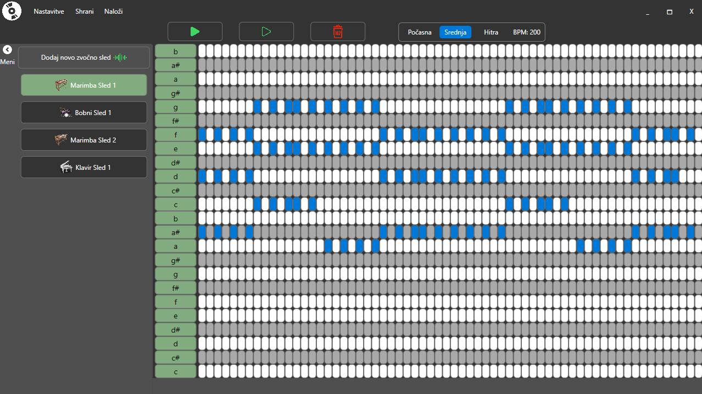
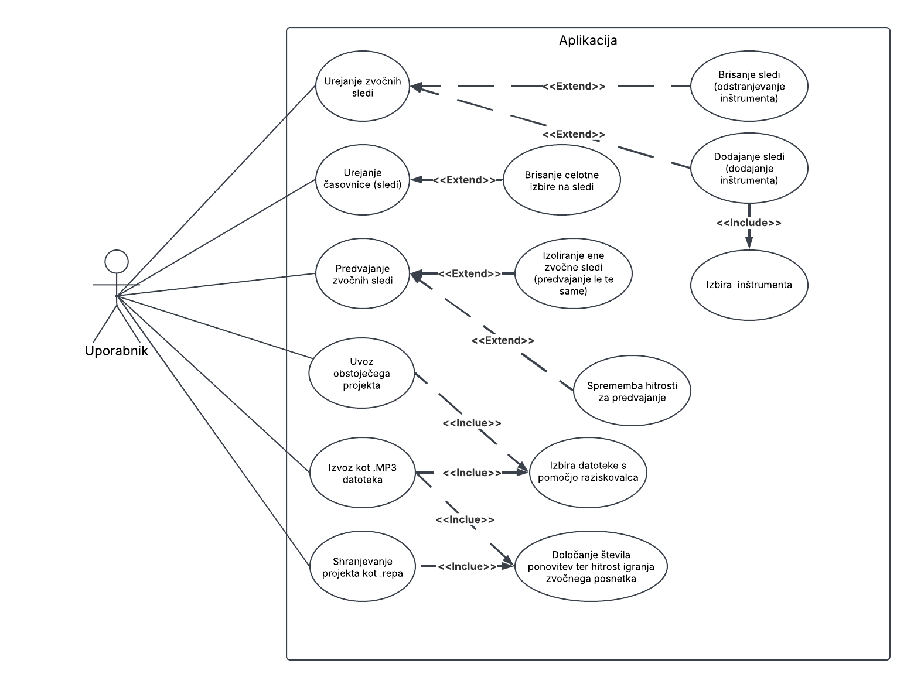

# Zvokarna

Zvokarna je preprosta namizna aplikacija, ki uporabniku omogoča ustvarjanje lastnih zvočnih posnetkov z uporabo različnih inštrumentov. Z enostavnim grafičnim vmesnikom lahko uporabnik hitro sestavi glasbene zanke, ritme in melodije.

## Izgled



## Glavne funkcionalnosti

- Dodajanje več različnih inštrumentov (klavir, marimba, bobni, ...)
- Vizualni urejevalnik (piano roll) za ustvarjanje in urejanje not
- Predvajanje posameznih sledi ali vseh hkrati
- Shranjevanje projektov v `.repa` formatu, ki vsebuje vse informacije o instrumentih in notah
- Izvoz zvočnega posnetka v `.mp3` formatu
- Nastavitve števila taktov, not v taktu in hitrosti (BPM)

## Primer projekta in izvoženega posnetka

- Primer izvoženega zvočnega posnetka: [primer .mp3 posnetka](datotekeZaReadme/repaVivaLaVida.mp3)
- Primer projekta v .repa datoteki: [primer projekta .repa](datotekeZaReadme/VivaLaVida3.repa)

## Tehnične podrobnosti

- Programski jezik: C#
- Uporabniški vmesnik: WPF (Windows Presentation Foundation)
- Knjižnica za delo z zvokom: [NAudio](https://github.com/naudio/NAudio)
- Ciljna platforma: Windows (.NET 6.0 ali novejši)

## Diagram primer uporabe



## Namestitev in zagon

1. Kloniraj repozitorij:

   ```bash
   git clone https://github.com/tvoje-uporabnisko-ime/zvokarna.git
   cd zvokarna
